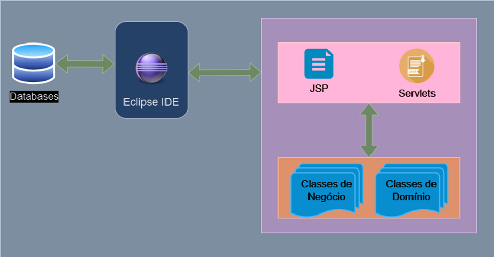
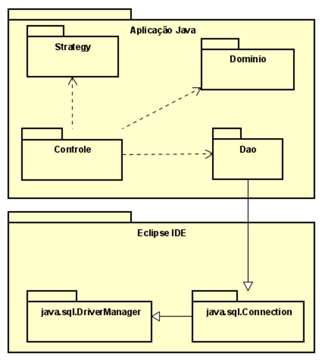

1.	Descrição

O sistema reunirá dois tipos de utilizadores que, pelas suas especificidades, poderão realizar diferentes operações no sistema.
Os usuários administradores poderão gerenciar pedidos e solicitações de troca, controlar estoque de produtos, revisar cadastros de clientes, além de gerar relatórios gráficos com base nas vendas por categoria.
Além de alterar ou excluir informações, outros usuários (clientes) poderão criar seus próprios registros de perfil. Eles também podem visualizar catálogos de produtos online e fazer compras usando cartões de crédito ou cupons. Caso deseje, poderá solicitar a troca após o recebimento do produto e, caso aprovado, será gerado um cupom de troca no mesmo valor do produto.

2.	Representação Arquitetural do Projeto

Os sistemas serão desenvolvidos tendo como base a arquitetura ilustrada na Figura 1. Toda a arquitetura será baseada nos padrões de projetos tradicionais do GoF e também nos padrões J2EE sendo executados dentro de um Servidor de Aplicações.

Figura 1 - Modelo Arquitetural Genérico

O Container contendo os arquivos JSP e Servlets, abrigará os componentes da arquitetura responsáveis pela camada de apresentação. 
As Classes de Domínio são as classes que representam os Value Object, contendo somente os atributos e os métodos getters/setters.
As Classes de Negócio representam as classes responsáveis por aplicar as regras de negócio do sistema como, por exemplo, todo cliente deve ter um endereço cadastrado associado. Constarão também nas classes de negócio as classes DAOs responsáveis por persistir e recuperar os objetos no banco de dados.
O diagrama a seguir, Figura 2, representa a organização das classes dentro dos pacotes, tanto da arquitetura como da aplicação que fará uso da arquitetura. 

Figura 2 - Diagrama em pacotes

